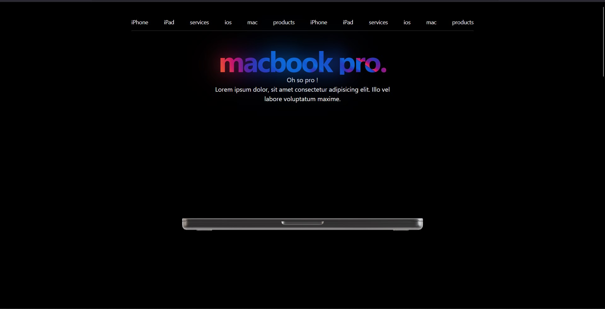
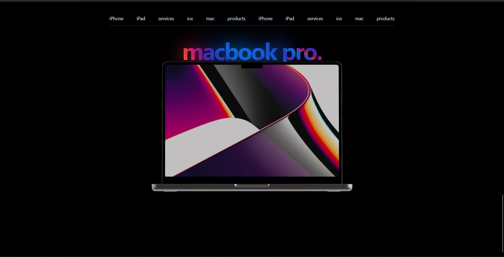

---

# MacBook 3D Model with Scroll Animation

This project showcases a 3D model of a MacBook, where the screen dynamically animates based on the scroll position. As users scroll, the MacBook screen smoothly opens and closes, providing an engaging interactive experience.

The website is built using **React**, **Three.js**, **React Three Fiber**, and **React Three Drei**, ensuring a smooth and immersive animation experience.

### Preview

### Acknowledgments

This project was made possible with the support and guidance from:

- **Sheriyans Coding School**
- **Harsh Vandana Sharma (Harsh Bhaiya)**

Their resources and mentorship played a crucial role in bringing this project to life

---life. 
